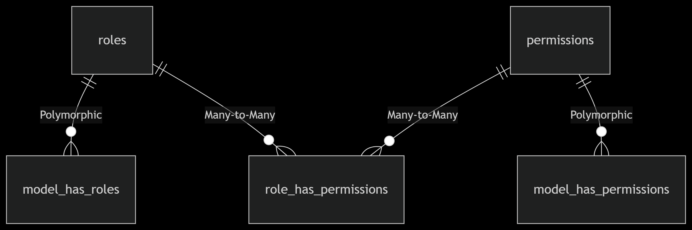

# Laravel Role & Permission by Mayar

A **lightweight, flexible, and fully database-driven** Role & Permission system for Laravel.
Inspired by Spatie but **custom-built** for **performance, flexibility, and full control over logic & database schema**.

---

## 1. Introduction

This package provides **Role-Based Access Control (RBAC)** for Laravel.

It allows you to:

* Create roles and permissions
* Assign roles and permissions to any model (Users, Admins, Vendors, etc.)
* Check access using **Blade directives** or **middleware**
* Store everything in the database with **polymorphic relationships**

Unlike other packages, **you have full control** over migrations, tables, and logic.

---

## 2. Features

* Assign **roles & permissions** to **any model**
* **Database-driven & polymorphic** (multi-model support)
* Built-in **Blade directives**: `@role`, `@can`
* Built-in **Route Middleware**: `role:admin`, `permission:edit-posts`
* **Easy to extend** and modify
* **Lightweight & dependency-free**

---

## 3. Installation

### 3.1 Install the Package

If using locally in `packages/Mayar/RolePermission`:

```bash
composer config repositories.mayar-role-permission path ./packages/Mayar/RolePermission
composer require mayar/role-permission:@dev
```

---

### 3.2 Run Migrations

```bash
php artisan migrate
```

This will create the following tables:

| Table                   | Description                            |
| ----------------------- | -------------------------------------- |
| `roles`                 | Stores role names                      |
| `permissions`           | Stores permission names                |
| `model_has_roles`       | Assigns roles to models                |
| `model_has_permissions` | Assigns permissions directly to models |
| `role_has_permissions`  | Links roles with permissions           |

---


## 4. Configuration

### 4.1 Add Trait to Your User Model

```php
use Mayar\RolePermission\Traits\HasRoles;

class User extends Authenticatable
{
    use HasRoles;
}
```

---

### 4.2 Register Middleware

In `app/Http/Kernel.php`:

```php
protected $routeMiddleware = [
    'role' => \Mayar\RolePermission\Http\Middleware\RoleMiddleware::class,
    'permission' => \Mayar\RolePermission\Http\Middleware\PermissionMiddleware::class,
];
```

---

### 4.3 Use Blade Directives

```blade
@role('admin')
    <a href="/admin">Admin Dashboard</a>
@endrole

@can('edit-posts')
    <button>Edit Post</button>
@endcan
```

---

## 5. Database Schema

```
roles:                 id | name | guard_name | timestamps
permissions:           id | name | guard_name | timestamps
model_has_roles:       id | role_id | model_type | model_id | timestamps
model_has_permissions: id | permission_id | model_type | model_id | timestamps
role_has_permissions:  id | role_id | permission_id | timestamps
```

---

## 6. Usage Guide

### 6.1 Create Roles & Permissions

```php
use Mayar\RolePermission\Models\Role;
use Mayar\RolePermission\Models\Permission;

$admin = Role::create(['name' => 'admin']);
$editor = Role::create(['name' => 'editor']);

$editPosts = Permission::create(['name' => 'edit-posts']);
$deletePosts = Permission::create(['name' => 'delete-posts']);
```

---

### 6.2 Assign to Users

```php
use App\Models\User;

$user = User::find(1);

// Assign a role
$user->assignRole('admin');  

// Give a direct permission
$user->givePermissionTo('edit-posts');
```

---

### 6.3 Check Roles & Permissions

```php
$user->hasRole('admin');            // true or false
$user->hasPermission('edit-posts'); // true or false
```

---

### 6.4 Blade Directives

```blade
@role('admin')
    Welcome Admin!
@endrole

@can('edit-posts')
    <button>Edit</button>
@endcan
```

---

### 6.5 Middleware Usage

```php
Route::get('/admin', fn() => 'Admin Page')->middleware('role:admin');
Route::get('/edit', fn() => 'Edit Page')->middleware('permission:edit-posts');
```

---

## 7. Seeder Example

Create `database/seeders/RolePermissionSeeder.php`:

php artisan db:seed --class=RolePermissionSeeder

```php
namespace Database\Seeders;

use Illuminate\Database\Seeder;
use Mayar\RolePermission\Models\Role;
use Mayar\RolePermission\Models\Permission;
use App\Models\User;

class RolePermissionSeeder extends Seeder
{
    public function run()
    {
        $adminRole = Role::create(['name' => 'admin']);
        $editorRole = Role::create(['name' => 'editor']);

        $edit = Permission::create(['name' => 'edit-posts']);
        $delete = Permission::create(['name' => 'delete-posts']);

        $adminRole->permissions()->attach([$edit->id, $delete->id]);

        $user = User::first();
        if ($user) {
            $user->assignRole('admin');
            $user->givePermissionTo('edit-posts');
        }
    }
}
```

Run:

```bash
php artisan db:seed --class=RolePermissionSeeder
```

---

## 8. Demo Routes

```php
use Illuminate\Support\Facades\Route;

Route::middleware(['role:admin'])->get('/admin', function () {
    return 'Welcome Admin!';
});

Route::middleware(['permission:edit-posts'])->get('/edit', function () {
    return 'Edit Page';
});
```

---

## 9. Testing the Package

1. **Run Migrations & Seed**

```bash
php artisan migrate --seed
```

2. **Login as First User**

   * Visit `/admin` → should work
   * Visit `/edit` → should work

3. **Test Blade**

```blade
@role('admin')
    <p>You are an Admin</p>
@endrole
```

---

## 10. Contributing

Pull requests are welcome!
Open an issue first to discuss changes.

---

## 11. License

**MIT License © 2025 Mayar**

